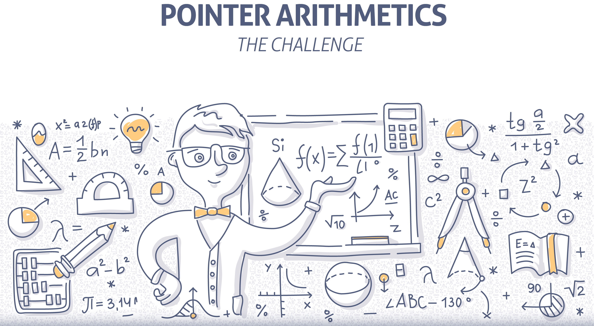

<p align="center">
  
  <br><br>
  <h2 align="center">The Pointer Arithmetics Challenge</h2>
  <p align="center">A bite-sized C coding brain teaser.</p>
  <p align="center">
    <a href="https://github.com/codespaces/new/HQarroum/sns-filter"></a>
  </p>
</p>
<br>

## 🚀 The Challenge

> I participated to a programming contest a few years ago, and came across an interesting challenge related to pointer arithmetic in C. I decided to create a write-up on the subject to expose the problem and the proposed solution.

The goal of the challenge is to retrieve the pointer to a structure given a pointer to one of its member. The challenge must be done independently of the number of members in the structure, the size of the structure, or the compiler which can vary during the test of implementation.

For the purpose of the challenge, we will consider the following structure of type `t_struct` which holds a float, an int (our member, aptly named member) and a char :

```c
typedef struct {
  float f;
  int member;
  char c;
} t_struct;
```

We need to provide a function that takes a pointer to a member of a structure and returns a pointer to the actual structure. The function must be prototyped as follow :

```c
t_struct* get_struct_ptr(void* member);
```

The `get_struct_ptr` function is expected to be used as in the following example by the testing application provided during the contest.

```c
int main(void) {
  t_struct  test = {
    .f = 1.0,
    .member = 42,
    .c = 0x42
  };
  t_struct* ptr = get_struct_ptr(&test.member);
  return (ptr == &test ? EXIT_SUCCESS : EXIT_FAILURE);
}
```

## 💡 The Solution

> For a full explanation of the solution, please see the [deep-dive article on Medium](https://medium.com/@HalimQarroum/the-pointer-arithmetics-challenge-42c5a8d58314).

This repository contains a working solution that should be working with all ANSI/C compilers. It currently has been tested on `GCC 10` and `Clang 12`.

## 👀 See also

- The [`offsetof()`](http://en.wikipedia.org/wiki/Offsetof) macro.
- The [deep-dive article on Medium](https://medium.com/@HalimQarroum/the-pointer-arithmetics-challenge-42c5a8d58314).
